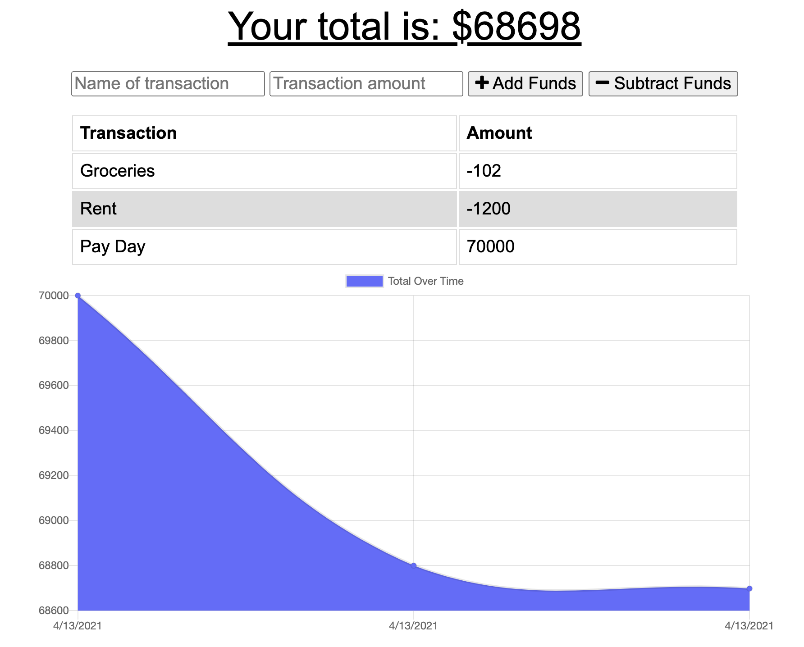

# Online/Offline Budget Tracker

  
## Description

This Budget Tracker application allows for both online and offline access and functionality for users.

Users are able to add expenses and deposits to their budget with or without a connection. When entering transactions offline, the information is saved and then is populated when brought back online.

## Tableof Contents

* [Deployed_Application](#Deployed_Application)
* [Usage](#Usage)
* [Mockup](#Mock-Up)
* [Schema](#Schema)
* [License](#License)
* [Questions](#Questions)
  
## Deployed_Application

To access this deployed application, visit the following link: [Budget Tracker Application](https://budgettrackerjr.herokuapp.com/)

## Usage

Budget Tracker is an interactive workout application that utilzes MongoDB, Node, Express, HTML, JavaScript, API Routes, Service Workers, Cached information, and an indexed db.

Budget Tracker uses Node and Mongo to query and route data to the application, and generate the HTML. While utilizing this application the user is able to: track transactions, either adding or subtracting funds.

This application will work both online and offline by means of service workers, cached data, and indexed db.

## Mock-Up

## Schema

### Database

The database that is being utilized is "budget", this is hosted on mongodb locally and Mongo Atlas on Heroku

### Models

Inside the database there is a document created titled transactionSchema. This Schema is comprised of the name of the transaction, the value of the transaction, and current date.

## License

Thisapplication has a MIT License type. Please read more about permissions at [Choose A License](https://choosealicense.com/licenses/)

## Questions

Please reach out to me with any additional questions by contacting me.

* GitHub Profile: [ross1jk](https://github.com/ross1jk)
* My Email Address: [Jacqueline.ross09@gmail.com](jacqueline.ross09@gmail.com)